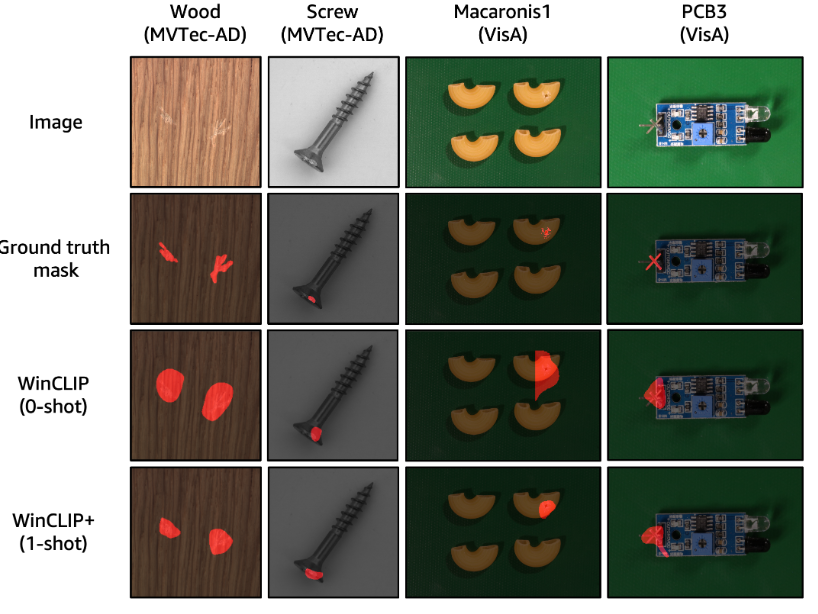

# WinCLIP: Zero-/Few-Shot Anomaly Classification and Segmentation
<p align="center"></p>
Unofficial implementation of:

WinCLIP: Zero-/Few-Shot Anomaly Classification and Segmentation, CVPR 2023 [[Paper]](https://openaccess.thecvf.com/content/CVPR2023/html/Jeong_WinCLIP_Zero-Few-Shot_Anomaly_Classification_and_Segmentation_CVPR_2023_paper.html)


## Citation
If you find the code useful, please consider citing our paper using the following BibTeX entry.
```
@InProceedings{Jeong_2023_CVPR,
    author    = {Jeong, Jongheon and Zou, Yang and Kim, Taewan and Zhang, Dongqing and Ravichandran, Avinash and Dabeer, Onkar},
    title     = {WinCLIP: Zero-/Few-Shot Anomaly Classification and Segmentation},
    booktitle = {Proceedings of the IEEE/CVF Conference on Computer Vision and Pattern Recognition (CVPR)},
    month     = {June},
    year      = {2023},
    pages     = {19606-19616}
}
```

## Related Research
```
@misc{cao2023segment,
      title={Segment Any Anomaly without Training via Hybrid Prompt Regularization}, 
      author={Yunkang Cao and Xiaohao Xu and Chen Sun and Yuqi Cheng and Zongwei Du and Liang Gao and Weiming Shen},
      year={2023},
      eprint={2305.10724},
      archivePrefix={arXiv},
      primaryClass={cs.CV}
}
```

## (Reproduction Guide & FAQ)
This project is based on the original WinCLIP implementation, but some necessary adjustments were made to the current (2025) hardware and environment during the reproduction process. If you have difficulties in reproducing, please refer to the following steps

### 1. Environment Configuration for New-generation NVIDIA GPUs (RTX 30/40/50 Series)

**Issue Description:**  
The original project's recommended PyTorch version (e.g. torch==1.10.0+cu113) was compiled with older CUDA 11.3. For users with new-generation NVIDIA GPUs like RTX 5060 Laptop: Driver versions (e.g. CUDA 12.x)  are incompatible with legacy PyTorch builds.

**Solution:**  
Must install PyTorch versions compatible with new hardware and CUDA toolchain. Our tests show that even some "Stable" releases may lack full support - **Nightly/Preview builds** are recommended in this case.

## Related Repo

- [Segment Any Anomaly](https://github.com/caoyunkang/Segment-Any-Anomaly) 

#### Install python dependencies

```
sh install.sh
```

#### Download MVTec-AD dataset
* Follow instructions in https://www.mvtec.com/company/research/datasets/mvtec-ad/

#### Download Visa dataset
* Follow instructions in https://paperswithcode.com/dataset/visa

## Run run_winclip.py to reproduce the implementation results
```
python run_winclip.py
```

## Results

### MVTec-AD
| MVTec-AD   | Reported |         |          |          | Re-implementation |         |          |          |
| ---------- | -------- | ------- | -------- | -------- | ----------------- | ------- | -------- | -------- |
|            | i-auroc  | p-auroc | i-max-f1 | p-max-f1 | i-auroc           | p-auroc | i-max-f1 | p-max-f1 |
| carpet     | 100.00   | 95.40   | 99.40    | 49.70    | 81.62             | 91.11   | 89.23    | 34.34    |
| grid       | 98.80    | 82.20   | 98.20    | 18.60    | 48.62             | 75.03   | 85.71    | 8.35     |
| leather    | 100.00   | 96.70   | 100.00   | 39.70    | 98.27             | 97.79   | 96.30    | 31.76    |
| tile       | 100.00   | 77.60   | 99.40    | 32.60    | 75.72             | 71.39   | 85.08    | 25.22    |
| wood       | 99.40    | 93.40   | 98.30    | 51.50    | 92.11             | 90.12   | 91.60    | 39.00    |
| bottle     | 99.20    | 89.50   | 97.60    | 58.10    | 99.05             | 89.93   | 97.60    | 52.68    |
| cable      | 86.50    | 77.00   | 84.50    | 19.70    | 44.57             | 49.37   | 76.35    | 5.74     |
| capsule    | 72.90    | 86.90   | 91.40    | 21.70    | 54.61             | 84.39   | 90.46    | 10.01    |
| hazelnut   | 93.90    | 94.30   | 89.70    | 37.60    | 74.46             | 96.18   | 79.49    | 42.48    |
| metal_nut  | 97.10    | 61.00   | 96.30    | 32.40    | 42.57             | 44.55   | 89.42    | 22.65    |
| pill       | 79.10    | 80.00   | 91.60    | 17.60    | 76.95             | 89.05   | 91.58    | 27.02    |
| screw      | 83.30    | 89.60   | 87.40    | 13.50    | 64.89             | 90.08   | 85.61    | 9.10     |
| toothbrush | 87.50    | 86.90   | 87.90    | 17.10    | 60.28             | 87.95   | 83.87    | 12.77    |
| transistor | 88.00    | 74.70   | 79.50    | 30.50    | 71.71             | 71.05   | 67.39    | 18.64    |
| zipper     | 91.50    | 91.60   | 92.90    | 34.40    | 89.26             | 92.08   | 90.38    | 31.46    |
| Average    | 91.81    | 85.12   | 92.94    | 31.65    | 71.65             | 81.34   | 86.67    | 24.75    |

### VisA

| VisA       | Reported |         |          |          | Re-implementation |         |          |          |
| ---------- | -------- | ------- | -------- | -------- | ----------------- | ------- | -------- | -------- |
|            | i-auroc  | p-auroc | i-max-f1 | p-max-f1 | i-auroc           | p-auroc | i-max-f1 | p-max-f1 |
| candle     | 95.40    | 88.90   | 89.40    | 22.50    | 84.88             | 89.96   | 78.01    | 6.39     |
| capsules   | 85.00    | 81.60   | 83.90    | 9.20     | 54.13             | 65.64   | 76.92    | 1.46     |
| cashew     | 92.10    | 84.70   | 88.40    | 13.20    | 65.48             | 86.28   | 80.82    | 8.32     |
| chewinggum | 96.50    | 93.30   | 94.80    | 41.10    | 83.50             | 96.59   | 83.33    | 30.30    |
| fryum      | 80.30    | 88.50   | 82.70    | 22.10    | 51.22             | 84.05   | 80.00    | 12.85    |
| macaroni1  | 76.20    | 70.90   | 74.20    | 7.00     | 55.51             | 56.83   | 66.67    | 0.45     |
| macaroni2  | 63.70    | 59.30   | 69.80    | 1.00     | 54.23             | 52.27   | 67.35    | 0.08     |
| pcb1       | 73.60    | 61.20   | 71.00    | 2.40     | 59.32             | 39.27   | 67.80    | 0.93     |
| pcb2       | 51.20    | 71.60   | 67.10    | 4.70     | 62.83             | 60.74   | 68.91    | 0.61     |
| pcb3       | 73.40    | 85.30   | 71.00    | 10.30    | 56.88             | 68.19   | 67.34    | 1.19     |
| pcb4       | 79.60    | 94.40   | 74.90    | 32.00    | 81.58             | 92.46   | 75.54    | 21.95    |
| pipe_fryum | 69.70    | 75.40   | 80.70    | 12.30    | 83.56             | 93.95   | 84.21    | 22.73    |
| Average    | 78.06    | 79.59   | 78.99    | 14.82    | 66.09             | 73.85   | 74.74    | 8.94     |

## Acknowledgements
This project borrows some code from [OpenCLip](https://github.com/mlfoundations/open_clip) and [CDO](https://github.com/caoyunkang/CDO), thanks for their admiring contributions~!